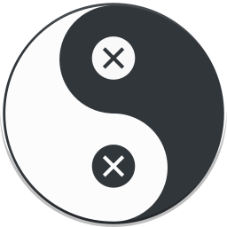

# Yin-Yang KDE 

   

Yin & Yang brings Auto Night-mode for Linux, it supports popular Desktops like KDE, Gnome, Budgie and also themes your favourite Editors like VSCode or Atom. 

## Features

* workes on Gnome, Budgie and KDE - all major Desktops
* toggles themes from light / dark
* supports VSCode
* support Atom
* support Wallpaper change based on themes
* toggle themes based on given time

## Documentation

Want to know more? Visit the Wiki and read about Installation, Building, Troubleshooting and more.

## Wallpapers

Yin-Yang comes with custom made Wallpaper in order to get you started with Light / Dark Wallpapers, you can check out the repository here

The Wallpapers are open source and can be used however you want. I also accept contributions in form of open source Wallpapers see the [contribution Section](https://github.com/daehruoydeef/Yin-Yang/wiki/Supporting-Yin-Yang#create-yin-yang-wallpapers).

## Why I created Yin & Yang KDE

I found myself constantly switching between themes to match my surrounding lights. I prefer a Dark theme at Night while I want good readability at Day time. I want to easily switch my whole enviroment to a dark / light theme based on a pre defined time. I wanted to provide this as open software so everyone can benefit and I hope that I inspire other talented developers to also start a open source Project and better the Linux Desktop. This is why I created Yin-Yang.

## Contributors

This list features community contributors

* [eogan](https://github.com/eogan)
* [alxlg](https://github.com/alxlg)
* [Gesmir](https://github.com/Gesmir)

if you want to join the club and want to see your name on the list see the Contributors Page in the Wiki

## Supporting Yin-Yang

Yin-Yang is an open source project. It's an independent project with its ongoing development made possible thanks to the support by our amazing backers. If you like this project and would like to see more time invested in this think about Donating.

**LibraPay**:  

