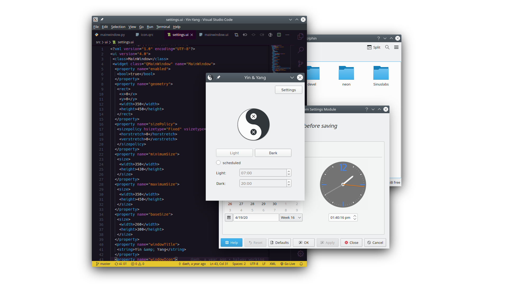
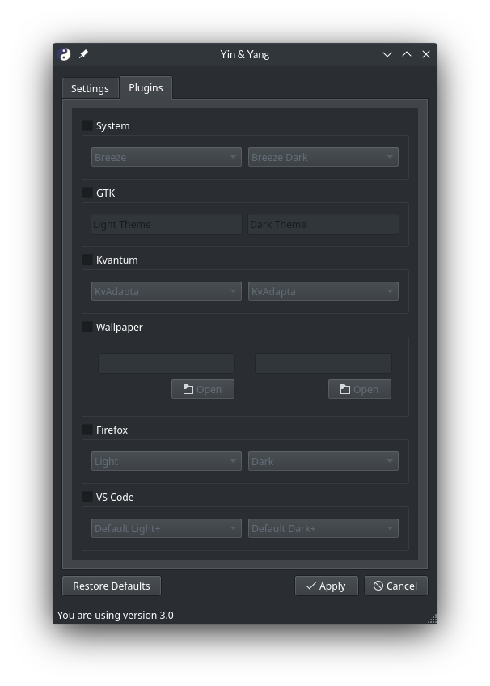

#  Yin-Yang


Auto Night-mode for Linux, it supports popular Desktops like KDE, GNOME, Budgie
and also themes your favourite editors like VSCode or Atom.

You might also want to take a look at our [**discussions page**](https://github.com/oskarsh/Yin-Yang/discussions), where we talk about the future of the app and other cool stuff!




## Features

- Changes your themes at certain times or sunrise and sunset
- Supported Desktops:
  - GNOME
  - Budgie
  - KDE Plasma
- Supported applications:
  - VSCode, Atom, gedit
  - Firefox & Brave
  - Kvantum
  - Konsole
  - OnlyOffice
  - and more...
- Miscellaneous:
  - Wallpaper change
  - Notifications on theme change
  - Play a sound
  - Ability to run custom scripts

> To see planned features and the development status, visit the [project status page](https://github.com/oskarsh/Yin-Yang/projects?type=classic).

## Installation

### Flatpak

```bash
./scripts/flatpak-install.sh --user
```
For system-wide install, omit `--user`. See also `--help`

### Arch-based distributions

Yin-Yang can be downloaded from AUR as [yin-yang](https://aur.archlinux.org/packages/yin-yang) package.

### Source

Yin-Yang depends on `python-systemd` and `pyside6` from pypi. `python-systemd` requires you have installed the systemd-headers from your package manager. You also need python development headers (e.g. `python3-devel`) and the poetry build system for python.
Preferably install `PySide6-Essentials` and `PySide6-Addons` from your system package manager as well.
If they are not available there, uncomment the dependencies in `pyproject.toml`.

For CentOS, RHEL, and Fedora:

```bash
sudo dnf install gcc systemd-devel python3-devel libnotify poetry python3-pyside6
```

For OpenSUSE:

```bash
sudo zypper refresh
sudo zypper install gcc systemd-devel libnotify python311-poetry python3-PySide6
```

For Debian, Ubuntu, etc.

```bash
sudo apt update
sudo apt install libsystemd-dev gcc pkg-config python3-dev libnotify-bin python3-poetry python3-qtpy-pyside6
```

Then you can install Yin-Yang in a python virtual environment:

```bash
# bash is necessary to run the source command
bash
# Clones the code to your local machine
git clone https://github.com/oskarsh/Yin-Yang.git
cd Yin-Yang
# Installs Yin-Yang
./scripts/install.sh
```

For development, skip the installation and instead build python using Poetry. A virtual environment will be created for you:

```bash
# Load into virtual environment
poetry env use python
# Install dependencies
poetry sync
# Load Yin-Yang
poetry run python -m yin_yang
```

Make sure to run `flake8` on your files to avoid errors from the ci in PRs:
```bash
poetry run flake8
```

### Uninstall

Run `scripts/uninstall.sh` from a terminal and fill out the password.

## Documentation

Want to help out? Check out the wiki to learn how to contribute translations, plugins and more!

[](https://github.com/oskarsh/Yin-Yang/wiki)

## Related or similar projects

- Auto dark mode for Windows: https://github.com/AutoDarkMode/Windows-Auto-Night-Mode
- Auto dark mode extension for GNOME: https://extensions.gnome.org/extension/2236/night-theme-switcher/
- Auto dark mode for Jetbrains IDEs: https://github.com/weisJ/auto-dark-mode
- Sync dark mode with KDEs night color: https://github.com/adrium/knightadjuster
- darkman: https://gitlab.com/WhyNotHugo/darkman
- In Firefox, you can use the system theme to sync Firefox itself and supported applications with the theme of the system. When you use [dark reader](https://darkreader.org/), you can enable the system color automation.

## Thanks to all Contributors

### Code Contributors

This project exists thanks to all the people who contribute. [[Contribute](https://github.com/oskarsh/Yin-Yang/wiki/Contributing)].

[](https://github.com/oskarsh/Yin-Yang/graphs/contributors)

### Donate

<a href="https://opencollective.com/Yin-Yang/organization/0/website"></a>
<a href="https://opencollective.com/Yin-Yang/organization/1/website"></a>
<a href="https://opencollective.com/Yin-Yang/organization/2/website"></a>
<a href="https://opencollective.com/Yin-Yang/organization/3/website"></a>
<a href="https://opencollective.com/Yin-Yang/organization/4/website"></a>
<a href="https://opencollective.com/Yin-Yang/organization/5/website"></a>
<a href="https://opencollective.com/Yin-Yang/organization/6/website"></a>
<a href="https://opencollective.com/Yin-Yang/organization/7/website"></a>
<a href="https://opencollective.com/Yin-Yang/organization/8/website"></a>
<a href="https://opencollective.com/Yin-Yang/organization/9/website"></a>
