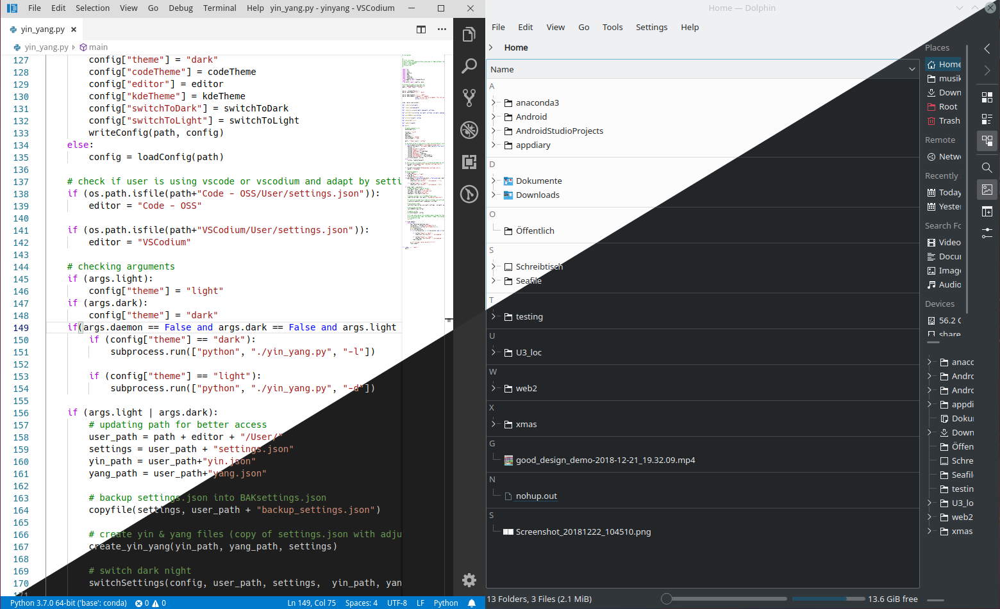

# Yin & Yang KDE 

Yin & Yang is a KDE tool which brings Auto Night-mode for KDE, VSCode and all GTK Apps like Firefox, Libreoffice and Chromium. Yin & Yang styles all KDE and QT5 tools, on Top of that it also themes VSCode or VSCodium. You can activate a Theme-toggle with shortcuts or let Yin-Yang toggle themes at scheduled Times.



## Installation

```bash
$ git clone git@github.com:daehruoydeef/Yin-Yang.git
$ cd Yin-Yang
$ sudo sh install.sh
```

Note: on the first run **yin_yang** will backup all necessary settings and create config files for your environment. If no arguments where given on the first run it sets itself to a light theme. Once you run yin_yang again without arguments you are able to toggle between themes.

## Hotkeys

Yin-Yang is about flexibility and stability, it does not provide basic shortcuts for **Dark/Light theme** toggle. It is recommended to add **Hotkeys with the KDE Hotkeys Module** found inside the **System preferences** under the **Hotkeys** section. Set any Hotkey you want to run the command:

```bash
$ yin-yang
```

## Auto updates

Yin-Yang features updates which will be fetched from this Repository as soon as a new Version is flagged with the release tag. If a update is available Yin-Yang will notify you and the next time you open Yin-Yang GUI you will be prompted to install a new Version.


## Why I created Yin & Yang KDE

## Requirements

If you do not got **qtpy** or **pyqt5** installed, Yin-Yang got your back by installing the necessary requirements on the go with pip3.

- pip3 \*
- python3 \*
- qtpy
- pyqt5
